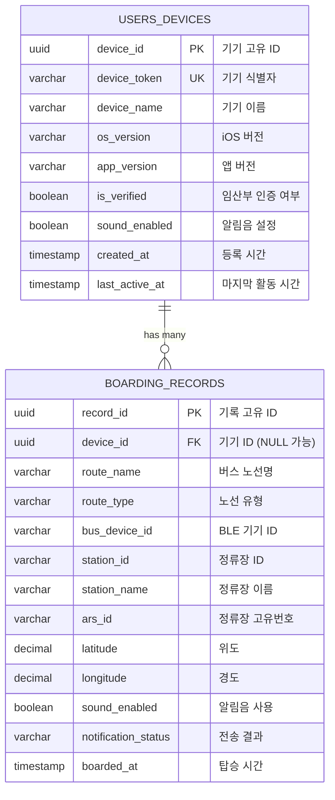
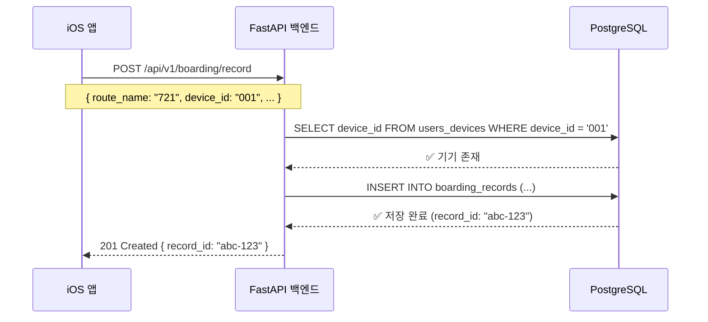

# Entity Relationship Diagram (ERD)

ComfortableMove 백엔드 데이터베이스의 테이블 관계도입니다.

---

## 📊 ERD 다이어그램

### Mermaid ERD



---

## 🔗 테이블 관계 설명

### 1. users_devices ↔ boarding_records

**관계 유형:** One-to-Many (1:N)

**의미:**
- 하나의 기기(`users_devices`)는 여러 개의 탑승 기록(`boarding_records`)을 가질 수 있습니다.
- 하나의 탑승 기록은 하나의 기기에만 속합니다 (또는 기기 없이 독립적으로 존재 가능).

**관계 표현:**
```
users_devices (1) ──────< boarding_records (N)
     부모                      자식
```

**Foreign Key 설정:**
```sql
boarding_records.device_id → users_devices.device_id
```

**삭제 정책:** `ON DELETE SET NULL`
- 기기가 삭제되어도 탑승 기록은 유지됩니다.
- 단, `device_id`는 NULL로 변경됩니다.

**예시:**
```
기기 A (device_id: 001)
  ├─ 탑승 기록 1 (721번 버스, 신설동역)
  ├─ 탑승 기록 2 (2012번 버스, 강남역)
  └─ 탑승 기록 3 (강동01번 버스, 천호역)

기기 B (device_id: 002)
  ├─ 탑승 기록 4 (9403번 버스, 잠실역)
  └─ 탑승 기록 5 (721번 버스, 신설동역)

익명 사용자 (device_id: NULL)
  └─ 탑승 기록 6 (2012번 버스, 강남역)
```

---

## 🎯 카디널리티 (Cardinality)

### users_devices → boarding_records

| 측면 | 값 | 설명 |
|------|-----|------|
| **최소값 (Minimum)** | 0 | 기기가 등록되어도 탑승 기록이 없을 수 있음 |
| **최대값 (Maximum)** | N | 무제한으로 탑승 기록 생성 가능 |

### boarding_records → users_devices

| 측면 | 값 | 설명 |
|------|-----|------|
| **최소값 (Minimum)** | 0 | 익명 사용자는 device_id가 NULL |
| **최대값 (Maximum)** | 1 | 하나의 탑승 기록은 최대 하나의 기기에만 속함 |

---

## 🔑 키 (Keys) 설명

### Primary Keys (PK)

| 테이블 | Primary Key | 타입 | 설명 |
|--------|-------------|------|------|
| `users_devices` | `device_id` | UUID | 기기 고유 식별자 |
| `boarding_records` | `record_id` | UUID | 탑승 기록 고유 식별자 |

**UUID 사용 이유:**
- ✅ 보안: 예측 불가능한 ID
- ✅ 분산 환경: 여러 서버에서 생성해도 충돌 없음
- ✅ 성능: 인덱스 효율적

### Foreign Keys (FK)

| 자식 테이블 | FK 컬럼 | 부모 테이블 | 참조 컬럼 | 삭제 정책 |
|------------|---------|------------|----------|----------|
| `boarding_records` | `device_id` | `users_devices` | `device_id` | SET NULL |

### Unique Keys (UK)

| 테이블 | Unique Key | 설명 |
|--------|------------|------|
| `users_devices` | `device_token` | 기기 식별자 중복 방지 (NULL 허용) |

---

## 📈 인덱스 전략

### users_devices 테이블

```sql
-- 1. Primary Key Index (자동 생성)
PRIMARY KEY (device_id)

-- 2. 기기 토큰 검색 최적화
CREATE INDEX idx_users_devices_token
ON users_devices(device_token)
WHERE device_token IS NOT NULL;

-- 3. 비활성 사용자 정리 쿼리 최적화
CREATE INDEX idx_users_devices_last_active
ON users_devices(last_active_at DESC);
```

**사용 사례:**
- 기기 토큰으로 사용자 찾기: `WHERE device_token = 'ABC123'`
- 30일 이상 미접속 사용자: `WHERE last_active_at < NOW() - INTERVAL '30 days'`

### boarding_records 테이블

```sql
-- 1. Primary Key Index (자동 생성)
PRIMARY KEY (record_id)

-- 2. Foreign Key Index
CREATE INDEX idx_boarding_records_device
ON boarding_records(device_id);

-- 3. 노선별 통계 쿼리 최적화
CREATE INDEX idx_boarding_records_route
ON boarding_records(route_name);

-- 4. 시간순 정렬 최적화
CREATE INDEX idx_boarding_records_boarded_at
ON boarding_records(boarded_at DESC);

-- 5. 정류장별 통계 쿼리 최적화
CREATE INDEX idx_boarding_records_station
ON boarding_records(station_id);

-- 6. 전송 성공률 분석 최적화
CREATE INDEX idx_boarding_records_status
ON boarding_records(notification_status);

-- 7. 복합 인덱스: 사용자별 최근 기록 조회
CREATE INDEX idx_boarding_records_device_date
ON boarding_records(device_id, boarded_at DESC);
```

**사용 사례:**
- 특정 사용자의 최근 탑승 기록: `WHERE device_id = '...' ORDER BY boarded_at DESC`
- 인기 노선 Top 10: `GROUP BY route_name ORDER BY COUNT(*) DESC`
- 최근 7일 전송 성공률: `WHERE boarded_at >= NOW() - INTERVAL '7 days' GROUP BY notification_status`

---

## 🔍 데이터 무결성 제약조건

### users_devices 제약조건

```sql
-- 1. 앱 버전 형식 체크 (예: "1.2.3")
CONSTRAINT chk_app_version
CHECK (app_version ~ '^\d+\.\d+\.\d+$')
```

**예시:**
- ✅ 통과: "1.0.0", "2.5.3", "10.20.30"
- ❌ 실패: "1.0", "v1.0.0", "1.0.0-beta"

### boarding_records 제약조건

```sql
-- 1. 알림 전송 상태 제한
CONSTRAINT chk_notification_status
CHECK (notification_status IN ('success', 'device_not_found', 'failure'))

-- 2. 위도 범위 체크 (-90 ~ 90)
CONSTRAINT chk_latitude
CHECK (latitude BETWEEN -90 AND 90)

-- 3. 경도 범위 체크 (-180 ~ 180)
CONSTRAINT chk_longitude
CHECK (longitude BETWEEN -180 AND 180)
```

**예시:**
```sql
-- ✅ 성공
INSERT INTO boarding_records (notification_status, latitude, longitude)
VALUES ('success', 37.5, 127.0);

-- ❌ 실패: notification_status가 허용되지 않는 값
INSERT INTO boarding_records (notification_status)
VALUES ('unknown');

-- ❌ 실패: 위도가 범위를 벗어남
INSERT INTO boarding_records (latitude)
VALUES (95.0);
```

---

## 📊 데이터 흐름 예시

### 시나리오: 사용자가 721번 버스 알림 전송



---

## 🔄 삭제 정책 시나리오

### Case 1: 기기 삭제 시 탑승 기록 보존

```sql
-- 1. 초기 상태
users_devices
┌──────────┬──────────────┐
│device_id │ device_token │
├──────────┼──────────────┤
│ 001      │ ABC123       │
└──────────┴──────────────┘

boarding_records
┌──────────┬──────────┬────────────┐
│record_id │device_id │ route_name │
├──────────┼──────────┼────────────┤
│ rec-1    │ 001      │ 721        │
│ rec-2    │ 001      │ 2012       │
└──────────┴──────────┴────────────┘

-- 2. 기기 삭제
DELETE FROM users_devices WHERE device_id = '001';

-- 3. 결과: 탑승 기록은 유지되지만 device_id가 NULL로 변경
boarding_records
┌──────────┬──────────┬────────────┐
│record_id │device_id │ route_name │
├──────────┼──────────┼────────────┤
│ rec-1    │ NULL     │ 721        │  ← device_id NULL로 변경
│ rec-2    │ NULL     │ 2012       │  ← device_id NULL로 변경
└──────────┴──────────┴────────────┘
```

**이유:**
- 통계 분석 시 과거 데이터가 필요하기 때문
- 개인정보는 삭제하되 익명화된 통계는 유지

---

## 📝 주요 쿼리 패턴

### 1. 사용자의 탑승 이력 조회

```sql
SELECT
    br.route_name,
    br.station_name,
    br.boarded_at,
    br.notification_status
FROM boarding_records br
WHERE br.device_id = '550e8400-e29b-41d4-a716-446655440000'
ORDER BY br.boarded_at DESC
LIMIT 20;
```

**사용 인덱스:** `idx_boarding_records_device_date`

---

### 2. 인기 노선 분석

```sql
SELECT
    route_name,
    route_type,
    COUNT(*) as boarding_count,
    COUNT(CASE WHEN notification_status = 'success' THEN 1 END) as success_count,
    ROUND(
        COUNT(CASE WHEN notification_status = 'success' THEN 1 END) * 100.0 / COUNT(*),
        2
    ) as success_rate
FROM boarding_records
WHERE boarded_at >= NOW() - INTERVAL '30 days'
GROUP BY route_name, route_type
ORDER BY boarding_count DESC
LIMIT 10;
```

**사용 인덱스:** `idx_boarding_records_route`, `idx_boarding_records_boarded_at`

---

### 3. 전체 사용자 수 및 활동 통계

```sql
SELECT
    COUNT(DISTINCT ud.device_id) as total_users,
    COUNT(DISTINCT CASE
        WHEN ud.last_active_at >= NOW() - INTERVAL '7 days'
        THEN ud.device_id
    END) as active_users_7d,
    COUNT(br.record_id) as total_boarding_records
FROM users_devices ud
LEFT JOIN boarding_records br ON ud.device_id = br.device_id;
```

**사용 인덱스:** `idx_users_devices_last_active`

---

## 🎨 다이어그램 범례

```
PK  = Primary Key (기본 키)
FK  = Foreign Key (외래 키)
UK  = Unique Key (고유 키)
||--o{ = One-to-Many relationship (1:N 관계)
||--|| = One-to-One relationship (1:1 관계)
}o--o{ = Many-to-Many relationship (N:M 관계)
```

---

## 📚 참고 문서

- [DATABASE_SCHEMA.md](./DATABASE_SCHEMA.md) - 상세한 스키마 정의
- [API_SPECIFICATION.md](./API_SPECIFICATION.md) - API 엔드포인트 명세
- PostgreSQL 공식 문서: https://www.postgresql.org/docs/

---

## 변경 이력

| 날짜 | 버전 | 변경 내용 |
|------|------|-----------|
| 2026-03-08 | 1.0.0 | 초기 ERD 설계 |
