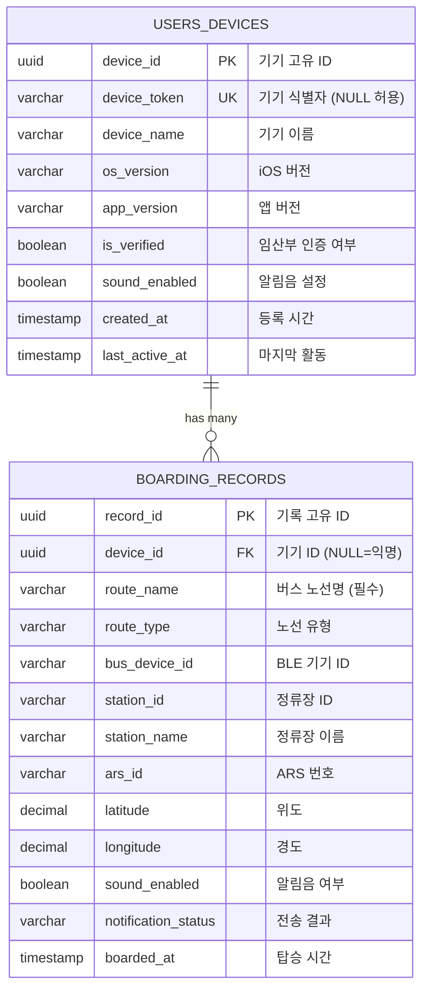

### 2주차 Todo

🚀 FastAPI 프레임워크 학습

- [x] **1.** FastAPI 설치 및 프로젝트 기본 구조 생성
- [x] **2.** 비동기 처리(`async/await`), 타입 힌트, 자동 문서 생성 이해

📋 API 설계

- [x] **3.** RESTful API 설계 원칙 학습 (HTTP 메서드, 상태 코드, URI)
- [x] **4.** 4개 엔드포인트 요청/응답 형식 정의 (`/health`, `/bus/arrivals`, `/boarding/record`, `/statistics`)

🗄️ 데이터베이스 설계

- [x] **5.** PostgreSQL 테이블 스키마 설계 (`users_devices`, `boarding_records`)
- [x] **6.** ERD 작성 (1:N 관계, UUID PK, 인덱스 전략)
- [x] **7.** SQLAlchemy ORM 모델 클래스 작성 (`UserDevice`, `BoardingRecord`)

🚌 서울시 버스 API 분석

- [x] **8.** 서울시 버스 API 응답 구조 분석 (정류장 조회, 도착 정보, 노선 조회)
- [x] **9.** API 연동 테스트 코드 작성 (Week 3 구현 준비)

📝 최종 결과물

- [x] **10.** 설계 문서 GitHub 커밋 (`backend/docs/` 전체)
- [x] **11.** SQLAlchemy 모델 클래스 GitHub 커밋 (`backend/app/models/`)

---

## 🚀 FastAPI 프레임워크 학습

### 1. 프로젝트 기본 구조 생성

FastAPI 백엔드 프로젝트를 위한 디렉토리 구조를 설계했다. 실제 프로덕션에서 사용하는 레이어드 아키텍처(Layered Architecture)를 적용했다.

```
backend/
├── app/
│   ├── __init__.py
│   ├── api/
│   │   ├── __init__.py
│   │   └── v1/           ← API 버전별 라우터 (Week 3 구현)
│   │       └── __init__.py
│   ├── core/             ← 설정, 보안 등 핵심 모듈 (Week 3 구현)
│   │   └── __init__.py
│   ├── db/               ← 데이터베이스 연결 (Week 3 구현)
│   │   └── __init__.py
│   ├── models/           ← SQLAlchemy ORM 모델 ✅
│   │   ├── __init__.py
│   │   ├── base.py
│   │   ├── user_device.py
│   │   └── boarding_record.py
│   ├── schemas/          ← Pydantic 스키마 (Week 3 구현)
│   │   └── __init__.py
│   └── services/         ← 비즈니스 로직 (Week 3 구현)
│       └── __init__.py
├── tests/
│   ├── unit/
│   └── integration/
│       └── test_seoul_bus_api.py
├── docs/
│   ├── API_SPECIFICATION.md
│   ├── DATABASE_SCHEMA.md
│   ├── ERD.md
│   └── SEOUL_BUS_API_ANALYSIS.md
├── requirements.txt
├── docker-compose.yml
└── .env.example
```

`requirements.txt`에 주요 의존성을 정의했다:

```txt
# FastAPI Framework
fastapi==0.109.0
uvicorn[standard]==0.27.0
pydantic==2.5.3
pydantic-settings==2.1.0

# Database
sqlalchemy==2.0.25
asyncpg==0.29.0
alembic==1.13.1

# Redis Cache
redis==5.0.1
aioredis==2.0.1

# HTTP Client
httpx==0.26.0

# Testing
pytest==7.4.4
pytest-asyncio==0.23.3
```

---

### 2. FastAPI 핵심 특징 이해

FastAPI가 Flask나 Django 대신 선택된 이유를 학습했다.

#### 2-1. 비동기 처리 (`async/await`)

FastAPI는 `asyncio` 기반으로 동작한다. 서울시 버스 API를 호출하거나 DB 쿼리를 할 때 I/O 대기 시간 동안 다른 요청을 처리할 수 있다.

```python
# 동기 방식 (blocking) - 하나씩 처리
def get_bus_arrival(ars_id: str):
    result = requests.get(SEOUL_API_URL)  # 여기서 블록킹
    return result.json()

# 비동기 방식 (non-blocking) - FastAPI 방식
async def get_bus_arrival(ars_id: str):
    async with httpx.AsyncClient() as client:
        result = await client.get(SEOUL_API_URL)  # 대기 중 다른 요청 처리
    return result.json()
```

**왜 비동기가 중요한가?**

맘편한 이동 앱은 버스 도착 시각 조회 시 서울시 외부 API를 호출한다. 이 과정에서 약 200~500ms의 네트워크 지연이 발생한다. 동기 처리 시 이 시간 동안 서버는 다른 요청을 받지 못하지만, 비동기 처리 시 대기 중에 다른 요청을 병렬 처리할 수 있다.

#### 2-2. 타입 힌트와 Pydantic

Python의 타입 힌트와 Pydantic을 결합하면 자동으로 입력 검증이 이루어진다.

```python
from pydantic import BaseModel, UUID4
from typing import Literal

class BoardingRecordRequest(BaseModel):
    device_id: UUID4 | None = None          # UUID 형식 자동 검증
    route_name: str                          # 필수값
    notification_status: Literal[           # 허용된 값만 통과
        "success",
        "device_not_found",
        "failure"
    ]
    latitude: float | None = None
    longitude: float | None = None

# 잘못된 요청 시 FastAPI가 자동으로 422 응답
# {"detail": [{"loc": ["body", "notification_status"], "msg": "..."}]}
```

#### 2-3. 자동 문서 생성 (Swagger UI)

FastAPI는 코드에서 자동으로 OpenAPI 문서를 생성한다. Week 3에서 구현하면 별도 문서 작성 없이 아래 URL에서 테스트가 가능하다:

- **Swagger UI**: `http://localhost:8000/docs`
- **ReDoc**: `http://localhost:8000/redoc`

---

## 📋 API 설계

### 3. RESTful API 설계 원칙 학습

RESTful API의 핵심 원칙을 정리했다.

#### HTTP 메서드 선택 기준

| 메서드 | 용도 | 멱등성 | 예시 |
|--------|------|--------|------|
| `GET` | 데이터 조회 | ✅ | 버스 도착 정보, 통계 |
| `POST` | 데이터 생성 | ❌ | 탑승 기록 저장 |
| `PUT` | 전체 수정 | ✅ | (미사용) |
| `PATCH` | 부분 수정 | ✅ | (미사용) |
| `DELETE` | 삭제 | ✅ | (미사용) |

#### HTTP 상태 코드

| 코드 | 의미 | 사용 시점 |
|------|------|-----------|
| `200 OK` | 성공 | GET 조회 성공 |
| `201 Created` | 생성 성공 | POST 탑승 기록 저장 |
| `400 Bad Request` | 잘못된 요청 | 입력값 검증 실패 |
| `404 Not Found` | 리소스 없음 | 기기/버스 정보 없음 |
| `503 Service Unavailable` | 외부 서비스 장애 | 서울시 버스 API 다운 |

#### URI 설계 원칙

```
✅ 좋은 URI 설계:
GET  /api/v1/bus/arrivals?ars_id=01234
POST /api/v1/boarding/record
GET  /api/v1/statistics/user/{device_id}

❌ 나쁜 URI 설계:
GET  /getBusArrival?id=01234     ← 동사 사용 금지
POST /saveBoardingRecord         ← 동사 사용 금지
GET  /statistics?user=device_id  ← 리소스 계층 미표현
```

### 4. API 명세서 작성 (4개 엔드포인트)

`backend/docs/API_SPECIFICATION.md`에 4개의 핵심 엔드포인트를 정의했다.

#### 엔드포인트 요약

| # | 엔드포인트 | 메서드 | 설명 |
|---|-----------|--------|------|
| 1 | `/health` | GET | 서버 상태 확인 |
| 2 | `/api/v1/bus/arrivals` | GET | 실시간 버스 도착 정보 |
| 3 | `/api/v1/boarding/record` | POST | 탑승 알림 기록 저장 |
| 4 | `/api/v1/statistics/user/{device_id}` | GET | 사용자 이용 통계 |

#### 헬스체크 (`GET /health`)

```json
// 200 OK - 정상
{
  "status": "healthy",
  "timestamp": "2026-03-08T10:30:00Z",
  "version": "1.0.0",
  "services": {
    "database": "connected",
    "redis": "connected",
    "seoul_bus_api": "reachable"
  }
}

// 503 Service Unavailable - 장애
{
  "status": "unhealthy",
  "services": {
    "database": "connected",
    "redis": "disconnected",   ← Redis 장애
    "seoul_bus_api": "reachable"
  },
  "errors": ["Redis connection failed"]
}
```

#### 버스 도착 정보 (`GET /api/v1/bus/arrivals?ars_id=01234`)

```json
// 200 OK
{
  "ars_id": "01234",
  "station_name": "신설동역",
  "arrivals": [
    {
      "route_name": "721",
      "route_type": "간선",
      "arrival_message": "2분후[2번째 전]",
      "congestion": "empty",
      "is_last_bus": false
    }
  ],
  "cached": true,             ← Redis 캐싱 여부
  "expires_at": "2026-03-08T10:30:30Z"
}
```

**캐싱 전략**: Redis TTL 60초, Cache Key `arrivals:{ars_id}`
- 캐시 히트: < 50ms 응답
- 캐시 미스: 서울 API 호출 후 저장, < 500ms 응답

#### 탑승 기록 저장 (`POST /api/v1/boarding/record`)

```json
// Request Body
{
  "device_id": "550e8400-e29b-41d4-a716-446655440000",  // 선택 (익명 허용)
  "route_name": "721",
  "notification_status": "success",  // success | device_not_found | failure
  "ars_id": "01234",
  "latitude": 37.575000,
  "longitude": 127.025000
}

// 201 Created
{
  "record_id": "660e8400-e29b-41d4-a716-446655440001",
  "message": "Boarding record saved successfully",
  "boarded_at": "2026-03-08T10:30:00Z"
}
```

#### 사용자 통계 (`GET /api/v1/statistics/user/{device_id}`)

```json
// 200 OK
{
  "device_id": "550e8400-...",
  "period": "30d",
  "statistics": {
    "total_notifications": 42,
    "success_rate": 90.48,
    "most_used_routes": [
      { "route_name": "721", "count": 15 }
    ],
    "activity_by_day_of_week": {
      "monday": 8, "tuesday": 7, "friday": 8
    }
  }
}
```

---

## 🗄️ 데이터베이스 설계

### 5. PostgreSQL 스키마 설계

#### `users_devices` 테이블

iOS 기기 정보를 저장한다. 회원가입 없이 UUID 기반으로 익명 사용자를 식별한다.

```sql
CREATE TABLE users_devices (
    device_id    UUID PRIMARY KEY DEFAULT gen_random_uuid(),
    device_token VARCHAR(255) UNIQUE,      -- iOS 기기 식별자 (선택)
    device_name  VARCHAR(100),             -- "iPhone 14 Pro"
    os_version   VARCHAR(20),              -- "iOS 17.2"
    app_version  VARCHAR(20),              -- "1.2.1"
    is_verified  BOOLEAN DEFAULT FALSE,    -- 임산부 인증 여부
    sound_enabled BOOLEAN DEFAULT TRUE,   -- 알림음 설정
    created_at   TIMESTAMP WITH TIME ZONE DEFAULT CURRENT_TIMESTAMP,
    last_active_at TIMESTAMP WITH TIME ZONE DEFAULT CURRENT_TIMESTAMP,

    CONSTRAINT chk_app_version CHECK (app_version ~ '^\d+\.\d+\.\d+$')
);
```

**설계 근거:**
- UUID 사용: 순차적 ID보다 보안에 유리, 분산 환경에서 충돌 없음
- `device_token` NULL 허용: 초기 익명 사용 허용, 추후 회원가입 시 업데이트

#### `boarding_records` 테이블

배려석 알림 전송 기록을 저장한다. 통계 분석과 성공률 추적이 주목적이다.

```sql
CREATE TABLE boarding_records (
    record_id   UUID PRIMARY KEY DEFAULT gen_random_uuid(),
    device_id   UUID REFERENCES users_devices(device_id) ON DELETE SET NULL,

    -- 버스 정보
    route_name  VARCHAR(20) NOT NULL,       -- "721", "강동01"
    route_type  VARCHAR(10),                -- "간선", "지선"
    bus_device_id VARCHAR(50),              -- BLE 기기 ID

    -- 정류장 정보
    station_name VARCHAR(100),
    ars_id       VARCHAR(20),

    -- 위치
    latitude    DECIMAL(10, 7),
    longitude   DECIMAL(10, 7),

    -- 알림 결과
    sound_enabled BOOLEAN DEFAULT TRUE,
    notification_status VARCHAR(20) NOT NULL,  -- success | device_not_found | failure
    boarded_at  TIMESTAMP WITH TIME ZONE DEFAULT CURRENT_TIMESTAMP,

    CONSTRAINT chk_notification_status
        CHECK (notification_status IN ('success', 'device_not_found', 'failure')),
    CONSTRAINT chk_latitude  CHECK (latitude BETWEEN -90 AND 90),
    CONSTRAINT chk_longitude CHECK (longitude BETWEEN -180 AND 180)
);

-- 통계 쿼리 최적화 인덱스
CREATE INDEX idx_boarding_records_device  ON boarding_records(device_id);
CREATE INDEX idx_boarding_records_route   ON boarding_records(route_name);
CREATE INDEX idx_boarding_records_at      ON boarding_records(boarded_at DESC);
CREATE INDEX idx_boarding_records_device_date
    ON boarding_records(device_id, boarded_at DESC);  -- 복합 인덱스
```

**`ON DELETE SET NULL` 정책 이유**: 기기를 삭제해도 익명화된 탑승 기록은 통계에 활용하기 위해 보존한다.

---

### 6. ERD (Entity Relationship Diagram)

#### ASCII ERD

```
┌─────────────────────────────────────────┐
│              users_devices              │
├─────────────────────────────────────────┤
│ PK  device_id        UUID (gen_uuid)    │
│ UK  device_token     VARCHAR(255) NULL  │
│     device_name      VARCHAR(100) NULL  │
│     os_version       VARCHAR(20)  NULL  │
│     app_version      VARCHAR(20)  NULL  │
│     is_verified      BOOLEAN  [FALSE]   │
│     sound_enabled    BOOLEAN  [TRUE]    │
│     created_at       TIMESTAMPTZ        │
│     last_active_at   TIMESTAMPTZ        │
└─────────────────────────────────────────┘
                  │
                  │ 1 : N  (ON DELETE SET NULL)
                  │ 하나의 기기는 여러 탑승 기록을 가짐
                  ↓
┌─────────────────────────────────────────┐
│             boarding_records            │
├─────────────────────────────────────────┤
│ PK  record_id        UUID (gen_uuid)    │
│ FK  device_id        UUID NULL ──────── │→ users_devices.device_id
│     route_name       VARCHAR(20) NOT NULL│
│     route_type       VARCHAR(10)  NULL  │
│     bus_device_id    VARCHAR(50)  NULL  │
│     station_id       VARCHAR(20)  NULL  │
│     station_name     VARCHAR(100) NULL  │
│     ars_id           VARCHAR(20)  NULL  │
│     latitude         DECIMAL(10,7) NULL │
│     longitude        DECIMAL(10,7) NULL │
│     sound_enabled    BOOLEAN  [TRUE]    │
│     notification_status VARCHAR(20) NN  │
│     boarded_at       TIMESTAMPTZ        │
└─────────────────────────────────────────┘

관계 유형: One-to-Many (1:N)
  users_devices  (1) ──────< boarding_records (N)
  부모 테이블                  자식 테이블

카디널리티:
  users_devices → boarding_records: 0 또는 N개 (기기 없이도 탑승 기록 존재 가능)
  boarding_records → users_devices: 0 또는 1개 (익명 사용자는 device_id=NULL)
```

#### Mermaid ERD



#### 인덱스 전략

| 인덱스 | 대상 컬럼 | 목적 |
|--------|-----------|------|
| PK 인덱스 | `device_id`, `record_id` | 기본키 조회 |
| Partial 인덱스 | `device_token` WHERE NOT NULL | 기기 토큰 검색 |
| 단순 인덱스 | `route_name` | 인기 노선 집계 |
| 단순 인덱스 | `boarded_at DESC` | 최신 기록 조회 |
| 복합 인덱스 | `(device_id, boarded_at DESC)` | 사용자별 최근 기록 |

**주요 쿼리 예시:**

```sql
-- 인기 노선 Top 10 (지난 30일)
SELECT route_name, COUNT(*) as count
FROM boarding_records
WHERE boarded_at >= NOW() - INTERVAL '30 days'
GROUP BY route_name
ORDER BY count DESC
LIMIT 10;

-- 사용자별 알림 성공률
SELECT
    notification_status,
    COUNT(*) as cnt,
    ROUND(COUNT(*) * 100.0 / SUM(COUNT(*)) OVER (), 2) as pct
FROM boarding_records
WHERE device_id = '550e8400-...'
GROUP BY notification_status;
```

---

### 7. SQLAlchemy ORM 모델 클래스 작성

SQLAlchemy 2.0의 `Mapped` 타입 어노테이션 방식을 사용하여 Python 타입 힌트와 통합했다.

#### Base 클래스

```python
# app/models/base.py
from sqlalchemy.orm import DeclarativeBase

class Base(DeclarativeBase):
    pass
```

모든 ORM 모델이 상속받는 기반 클래스다.

#### UserDevice 모델

```python
# app/models/user_device.py
import uuid
from sqlalchemy import Boolean, CheckConstraint, String, func
from sqlalchemy.dialects.postgresql import TIMESTAMP, UUID
from sqlalchemy.orm import Mapped, mapped_column, relationship
from app.models.base import Base

class UserDevice(Base):
    __tablename__ = "users_devices"

    device_id: Mapped[uuid.UUID] = mapped_column(
        UUID(as_uuid=True),
        primary_key=True,
        default=uuid.uuid4,
    )
    device_token: Mapped[str | None] = mapped_column(String(255), unique=True, nullable=True)
    device_name:  Mapped[str | None] = mapped_column(String(100), nullable=True)
    os_version:   Mapped[str | None] = mapped_column(String(20),  nullable=True)
    app_version:  Mapped[str | None] = mapped_column(String(20),  nullable=True)
    is_verified:  Mapped[bool]       = mapped_column(Boolean, default=False)
    sound_enabled: Mapped[bool]      = mapped_column(Boolean, default=True)
    created_at:   Mapped[datetime]   = mapped_column(TIMESTAMP(timezone=True), server_default=func.now())
    last_active_at: Mapped[datetime] = mapped_column(TIMESTAMP(timezone=True), server_default=func.now())

    __table_args__ = (
        CheckConstraint(r"app_version ~ '^\d+\.\d+\.\d+$'", name="chk_app_version"),
    )

    # 관계: 1:N
    boarding_records: Mapped[list["BoardingRecord"]] = relationship(
        "BoardingRecord", back_populates="device"
    )
```

**SQLAlchemy 2.0 `Mapped` 문법의 장점:**
- `Mapped[str | None]`으로 nullable 여부를 타입에서 직접 표현
- IDE에서 타입 추론이 정확하게 동작
- 기존 `Column(String, nullable=True)` 방식보다 더 파이써닉(Pythonic)

#### BoardingRecord 모델

```python
# app/models/boarding_record.py
class BoardingRecord(Base):
    __tablename__ = "boarding_records"

    record_id: Mapped[uuid.UUID] = mapped_column(UUID(as_uuid=True), primary_key=True, default=uuid.uuid4)

    # FK: nullable (익명 사용자 지원, 기기 삭제 시 SET NULL)
    device_id: Mapped[uuid.UUID | None] = mapped_column(
        UUID(as_uuid=True),
        ForeignKey("users_devices.device_id", ondelete="SET NULL"),
        nullable=True,
    )

    route_name:          Mapped[str]        = mapped_column(String(20),  nullable=False)
    route_type:          Mapped[str | None] = mapped_column(String(10),  nullable=True)
    notification_status: Mapped[str]        = mapped_column(String(20),  nullable=False)
    boarded_at:          Mapped[datetime]   = mapped_column(TIMESTAMP(timezone=True), server_default=func.now())

    __table_args__ = (
        CheckConstraint(
            "notification_status IN ('success', 'device_not_found', 'failure')",
            name="chk_notification_status",
        ),
        CheckConstraint("latitude BETWEEN -90 AND 90",   name="chk_latitude"),
        CheckConstraint("longitude BETWEEN -180 AND 180", name="chk_longitude"),
        # 통계 쿼리 최적화 인덱스
        Index("idx_boarding_records_route",       "route_name"),
        Index("idx_boarding_records_boarded_at",  "boarded_at"),
        Index("idx_boarding_records_device_date", "device_id", "boarded_at"),
    )

    device: Mapped["UserDevice | None"] = relationship("UserDevice", back_populates="boarding_records")
```

#### SQLAlchemy ORM vs 직접 SQL 비교

| 비교 항목 | ORM 방식 | 직접 SQL |
|-----------|----------|----------|
| 코드 가독성 | ✅ Python 객체처럼 다룸 | 문자열 SQL 관리 복잡 |
| 타입 안전성 | ✅ 타입 힌트 완전 지원 | ❌ 런타임에만 오류 발견 |
| 자동 마이그레이션 | ✅ Alembic 연동 | 수동 관리 필요 |
| 복잡 쿼리 | ❌ 집계/조인이 장황함 | ✅ 직관적으로 표현 |
| 성능 | 약간 오버헤드 | 최적화 용이 |

→ 맘편한 이동 백엔드는 단순 CRUD와 통계 쿼리 위주이므로 ORM이 적합하다고 판단했다.

---

## 🚌 서울시 버스 API 분석

### 8. 응답 구조 분석

서울시 버스 API(`http://ws.bus.go.kr/api/rest`)의 주요 3개 엔드포인트를 분석했다.

#### 위치 기반 정류장 조회

```
GET /stationinfo/getStationByPos
    ?ServiceKey={API_KEY}
    &tmX=127.025000     ← 경도 (Longitude)
    &tmY=37.575000      ← 위도 (Latitude)
    &radius=100
    &resultType=json
```

**응답 구조:**
```json
{
  "msgHeader": {
    "headerCd": "0",          // "0" = 성공
    "itemCount": 2
  },
  "msgBody": {
    "itemList": [
      {
        "stId": "123000001",  // 정류장 ID (station_id)
        "stNm": "신설동역",   // 정류장 이름
        "arsId": "01234",     // ARS ID (우리 ars_id)
        "tmX": "127.025000",  // 경도
        "tmY": "37.575000"    // 위도
      }
    ]
  }
}
```

#### 정류장 버스 도착 정보 조회

```
GET /stationinfo/getStationByUid
    ?ServiceKey={API_KEY}
    &arsId=01234
    &resultType=json
```

**응답 구조:**
```json
{
  "msgHeader": { "headerCd": "0", "itemCount": 3 },
  "msgBody": {
    "itemList": [
      {
        "rtNm": "721",             // 노선명 (route_name)
        "busRouteType": "3",       // 노선 유형 코드 (3=간선)
        "arrmsg1": "2분후[2번째 전]",  // 도착 메시지
        "mkTm": "0",               // 막차 여부 (1=막차)
        "full1": "0",              // 만차 여부 (1=만차)
        "congestion": "3"          // 혼잡도 (3=여유)
      }
    ]
  }
}
```

**버스 유형 코드 매핑:**

| API 코드 | 노선 유형 | 색상 |
|---------|----------|------|
| `1` | 공항 | 하늘색 |
| `2` | 마을 | 초록색 |
| `3` | 간선 | 파란색 |
| `4` | 지선 | 초록색 |
| `5` | 순환 | 노란색 |
| `6` | 광역 | 빨간색 |

**혼잡도 코드 매핑:**

| API 코드 | 혼잡도 | 설명 |
|---------|--------|------|
| `3` | `empty` | 여유 |
| `4` | `normal` | 보통 |
| `5` | `crowded` | 혼잡 |
| 기타 | `unknown` | 알 수 없음 |

#### iOS 앱과의 연동 포인트

iOS 앱이 사용 중인 API와 백엔드가 동일한 데이터 소스를 사용한다:

```
iOS BusStopService.getStations()        →  /stationinfo/getStationByPos
iOS BusArrivalService.getArrivalInfo()  →  /stationinfo/getStationByUid
iOS RouteService.getRouteInfo()         →  /businfo/getBusRouteList
```

백엔드는 iOS 앱 대신 이 API를 호출하고 Redis에 캐싱하여 제공한다. (중복 API 호출 감소 + 응답 속도 개선)

### 9. 연동 테스트 코드 준비

Week 3 구현 시 사용할 통합 테스트 코드의 뼈대를 작성했다(`backend/tests/integration/test_seoul_bus_api.py`).

```python
# Week 3에서 주석 해제 후 사용
@pytest.mark.integration
@pytest.mark.asyncio
async def test_get_station_by_position_seoul_station():
    """서울역 근처 정류장 조회"""
    # service = SeoulBusAPIService()
    # response = await service.get_stations_by_position(
    #     latitude=37.555946,
    #     longitude=126.972317,
    #     radius=100
    # )
    # assert response["msgHeader"]["headerCd"] == "0"
    pass

@pytest.mark.integration
async def test_get_bus_arrival_sinseoldong():
    """신설동역 버스 도착 정보 조회"""
    # 신설동역 ARS ID: 01234 기준 테스트
    pass
```

---

## 📝 최종 결과물

### 10-11. GitHub 커밋

이번 주 작업물 전체를 커밋했다:

```bash
$ git add backend/
$ git commit -m "[Feat] 2주차 - FastAPI 백엔드 기초 및 API 설계"
```

**커밋 내용:**
- `backend/app/models/` — SQLAlchemy ORM 모델 (UserDevice, BoardingRecord)
- `backend/docs/API_SPECIFICATION.md` — 4개 엔드포인트 API 명세서
- `backend/docs/DATABASE_SCHEMA.md` — PostgreSQL 스키마 정의
- `backend/docs/ERD.md` — 테이블 관계도 (Mermaid + 상세 설명)
- `backend/docs/SEOUL_BUS_API_ANALYSIS.md` — 서울시 버스 API 분석
- `backend/requirements.txt` — 의존성 목록
- `backend/docker-compose.yml` — PostgreSQL + Redis 컨테이너 설정
- `backend/tests/` — 테스트 코드 구조

```bash
$ git log --oneline -3
22e9cc0 [Feat] 2주차 - FastAPI 백엔드 기초 및 API 설계
3cad845 [Chore] Change Folder Settings
f86588b [Chore] 1주차 활동 내용 업데이트
```

---

## 📊 주차 회고

### 잘한 것

- API 명세서를 요청/응답 형식, 에러 코드, 캐싱 전략까지 상세하게 작성했다. Week 3 구현 시 명세서를 보고 바로 코딩 가능한 수준이다.
- SQLAlchemy 2.0의 최신 `Mapped` 타입 어노테이션 방식을 채택해서 타입 안전성을 높였다.
- 서울시 버스 API의 응답 구조를 직접 분석하고, iOS 앱의 데이터 파싱 로직(`BusRouteType`, `BusCongestion`)과 매핑 관계를 문서화했다.

### 아쉬운 것

- Docker Compose를 설치하고 PostgreSQL을 직접 띄워 실제 DB 연결 테스트까지 해보지 못했다.
- 서울시 버스 API를 직접 호출해서 응답을 눈으로 확인하지 못했다. (Week 3에서 진행 예정)

### 다음 주 (3주차) 계획

- FastAPI 앱 초기화 및 4개 엔드포인트 실제 구현
- Pydantic 스키마 작성 및 입력 검증 로직 구현
- 서울시 버스 API 실제 연동 및 Redis 캐싱 구현
- pytest 단위 테스트 작성
- Docker Compose로 전체 스택 로컬 실행
